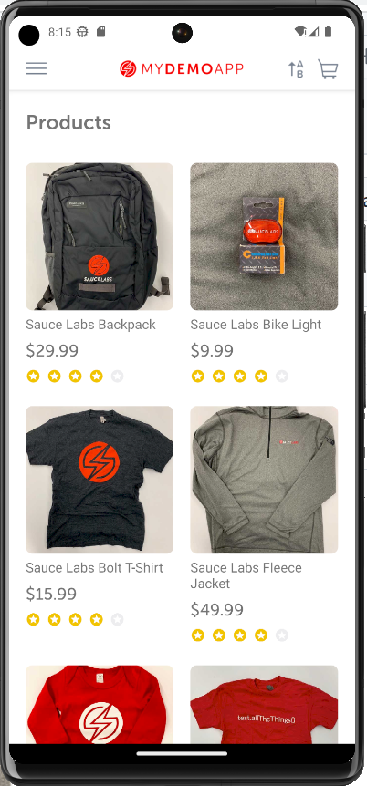

 
 #  *Mobile Test Automation with Appium 2* 
## 📱   End To End Test Order Scenario on Android App called *"Sauce labs"*  📱

 

 
 ### 📝 The main Frameworks included in the project:

 * Appium 2.x.x

 * java-client 8.x.x 
 
 * TestNG
 
 * Allure Report

 * Extent Report
 
 ### 🏗️ Project Design:

 * Page Object Model (POM) design pattern
 
 * Fluent design approach
 
 * Data Driven framework

 
 ### 🗃️ Documentation
* **[Appium Docs](http://appium.io/docs/en/2.0/quickstart/)**
 
 ### 🚧 Requirements

* Java JDK-17 
* Appium 2.x.x
* Maven
* Android Studio Emulator 

 ### 🚀 Running Tests

1. Start appium server: `appium` 
2. Start android emulator
3. Run testng.xml file 
4. Generate reports using allure report

### 📄 Open Allure Report: `allure serve allure-results`

### Test Scenario: Purchase a Product in Sauce Labs Mobile Application
#### ✅ End To End Test Cases

1.User opens the Sauce Labs mobile application.

2.User clicks on the "Menu" button.

3.User clicks on the "Login" option.

4.User logs in using a valid email and password.

5.User chooses a product to purchase.

6.User clicks on the "Counter Plus" button to add the selected product to the cart.

7.User clicks on the "Add to Cart" button to confirm the product addition.

8.User clicks on the "Cart Badge" icon to view the shopping cart.

9.User clicks on the "Proceed to Checkout" button.

10.User fills in the required checkout information.

11.User fills in the payment information.

12.User clicks on the "Place Order" button to complete the purchase.

13.User clicks on the "Continue Shopping" button.

14.Validate that the user returns to the home screen.

 
 

 
